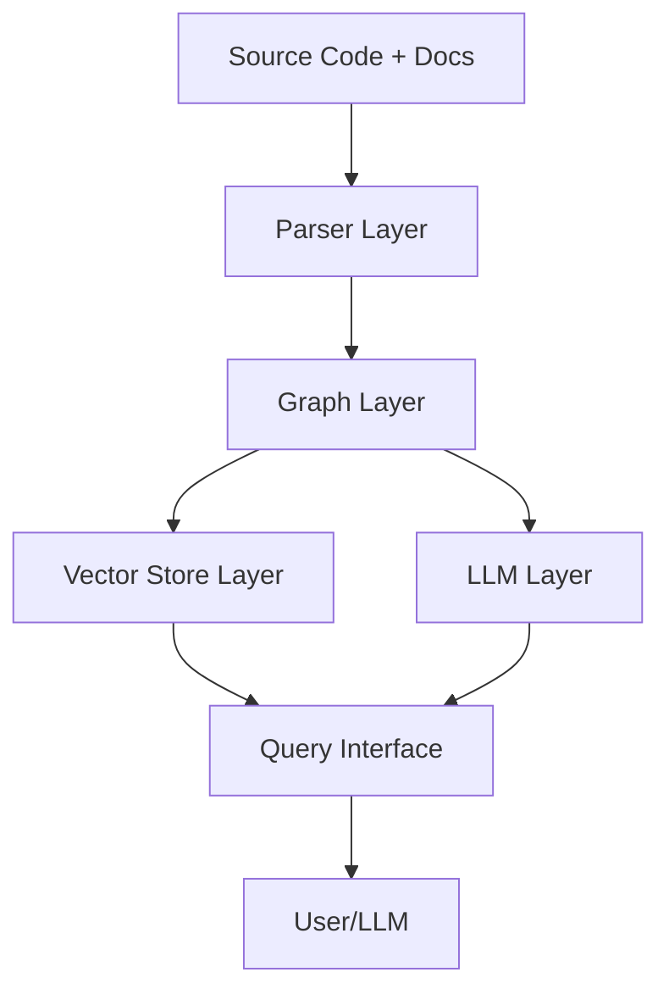
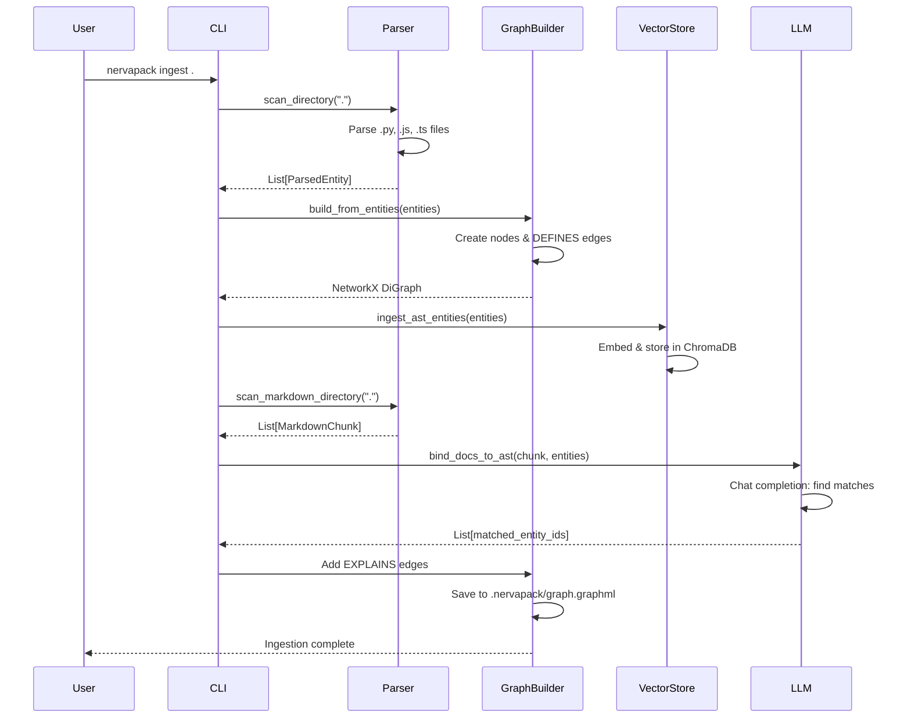
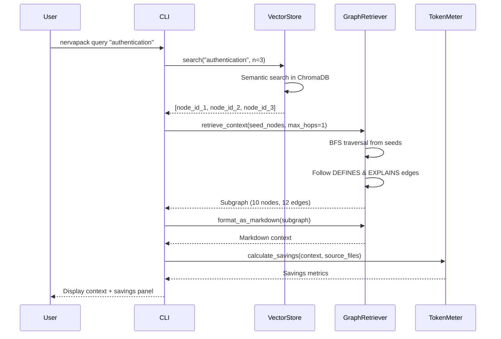
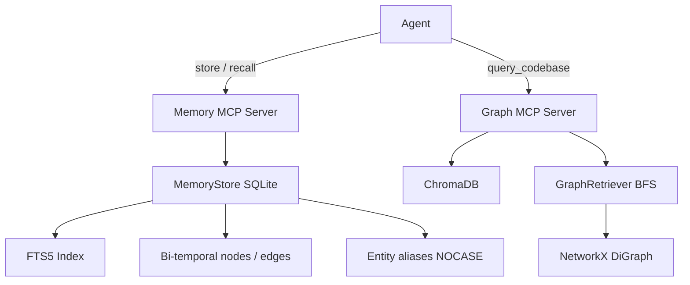

# Architecture

Understanding NervaPack's architecture helps you use it effectively and contribute to its development.

---

## High-Level Overview

NervaPack consists of four main components:



---

## Component Architecture

### 1. Parser Layer (`nervapack.parser`)

**Responsibility:** Convert source files into structured entities

**Components:**
- **ASTParser** — Uses tree-sitter to parse code files
- **MarkdownChunker** — Splits markdown by headers
- **LanguageRegistry** — Maps file extensions to parsers

**Flow:**
```
.py/.js/.ts file
    ↓
tree-sitter grammar
    ↓
AST nodes (class, function, import)
    ↓
ParsedEntity objects
```

**Key classes:**
- `ParsedEntity` — Data class for AST nodes
- `LanguageConfig` — Configuration for each language

---

### 2. Graph Layer (`nervapack.graph`)

**Responsibility:** Build and query the knowledge graph

**Components:**
- **GraphBuilder** — Creates NetworkX DiGraph
- **VectorStore** — ChromaDB semantic search
- **GraphRetriever** — K-hop BFS traversal
- **GraphAnalytics** — Health metrics
- **Visualizer** — Interactive HTML export

**Graph schema:**
```
Nodes:
  - file (path)
  - class (name, file_path, content, line_range)
  - function (name, file_path, content, line_range)
  - import (name, file_path)
  - markdown (header, content, file_path)

Edges:
  - DEFINES (file → class/function/import)
  - EXPLAINS (markdown → code entity)
```

**Example graph:**
```
file:src/auth.py
  ├─[DEFINES]→ class:AuthMiddleware
  ├─[DEFINES]→ function:authenticate_user
  └─[DEFINES]→ import:jwt

md:docs/auth.md
  └─[EXPLAINS]→ class:AuthMiddleware
```

---

### 3. LLM Layer (`nervapack.llm`)

**Responsibility:** Bind documentation to code

**Components:**
- **LLMProvider (base)** — Abstract interface
- **OllamaProvider** — Local Ollama integration
- **ClaudeAPIProvider** — Anthropic API
- **OpenAIProvider** — OpenAI API
- **MCPDelegationProvider** — MCP passthrough
- **LLMFactory** — Provider selection logic

**Binding process:**
```
Markdown chunk
    ↓
LLM prompt: "Which code entity does this explain?"
    ↓
LLM response: ["class:AuthMiddleware", "function:login"]
    ↓
Create EXPLAINS edges in graph
```

**Provider selection priority:**
1. MCP context detected → MCPDelegationProvider
2. `--llm` flag specified → Use that provider
3. API key env vars set → Use cloud API
4. Ollama running → OllamaProvider
5. Otherwise → Error with setup instructions

---

### 4. Vector Store Layer (`nervapack.graph.vector_store`)

**Responsibility:** Semantic search over entities

**Technology:** ChromaDB (local vector database)

**Process:**
```
ParsedEntity
    ↓
Generate summary (code snippet)
    ↓
Embed with ChromaDB (local model)
    ↓
Store in .nervapack/chroma_db/
    ↓
Query: "authentication" → Top-K similar entities
```

**Embeddings:**
- **Model:** ChromaDB default (all-MiniLM-L6-v2)
- **Dimension:** 384
- **Storage:** Local (no cloud)

---

## Data Flow: `nervapack ingest`



---

## Data Flow: `nervapack query`



---

## Storage Layout

```
project-root/
├── .nervapack/
│   ├── graph.graphml              # NetworkX graph (XML format)
│   ├── chroma_db/                 # ChromaDB vector store
│   │   ├── chroma.sqlite3         # Metadata
│   │   └── index/                 # Vector indices
│   ├── memory.db                  # Agent memory (SQLite, FTS5, bi-temporal)
│   ├── query_history.jsonl        # Query logs
│   ├── graph.html                 # Generated visualizations
│   ├── dependencies.html
│   └── explore_*.html
│
├── .nervapackignore               # Files to skip (like .gitignore)
└── .mcp.json                      # MCP server config (optional)
```

---

## Module Reference

| Module | Responsibility | Key Classes |
|--------|---------------|-------------|
| `parser.ast_parser` | AST parsing | `ASTParser`, `ParsedEntity` |
| `parser.md_chunker` | Markdown chunking | `MarkdownChunker` |
| `parser.language_registry` | Language configs | `LanguageConfig`, `LANGUAGE_REGISTRY` |
| `graph.builder` | Graph construction | `GraphBuilder` |
| `graph.vector_store` | Semantic search | `VectorStore` |
| `graph.retrieval` | Context extraction | `GraphRetriever` |
| `graph.visualizer` | HTML export | `export_html()` |
| `graph.visualizer_v2` | Enhanced visuals | `export_html_enhanced()` |
| `graph.analytics` | Health metrics | `GraphAnalytics` |
| `graph.query_history` | Query logging | `QueryHistory` |
| `graph.token_meter` | Token counting | `count_tokens()`, `render_savings_panel()` |
| `graph.dependency_analyzer` | Import analysis | `DependencyAnalyzer` |
| `llm.factory` | Provider selection | `get_llm_provider()` |
| `llm.providers.ollama` | Ollama integration | `OllamaProvider` |
| `llm.providers.claude_api` | Claude API | `ClaudeAPIProvider` |
| `llm.providers.openai_api` | OpenAI API | `OpenAIProvider` |
| `llm.providers.mcp_delegation` | MCP passthrough | `MCPDelegationProvider` |
| `git.tracker` | Git diff tracking | `GitTracker` |
| `mcp_server` | Knowledge-graph MCP server | `FastMCP` app |
| `memory.store` | Agent memory SQLite store | `MemoryStore` |
| `memory.recall` | FTS → expand → score → pack pipeline | `recall()`, `recall_timeline()` |
| `memory.pack` | Token counting and Markdown rendering | `pack()`, `CharTokenCounter` |
| `memory.resolve` | Entity alias resolution | `resolve_entities()` |
| `memory.mcp_server` | Memory MCP server (9 tools) | `FastMCP` app |
| `memory.cli` | Memory CLI | Typer commands |
| `cli` | Command-line interface | Typer commands |
| `dashboard.app` | Streamlit dashboard | `main()` |

---

## Design Principles

### 1. Privacy First
- All processing is local by default
- Cloud LLMs are opt-in with explicit warnings
- No telemetry or data collection

### 2. Deterministic Parsing
- AST nodes are structural (not heuristic)
- Graph is reproducible from same inputs
- No non-deterministic chunking

### 3. Incremental Updates
- GitPython tracks file changes
- Only changed files are re-indexed
- Graph diffs, not full rebuilds

### 4. Pluggable Architecture
- LLM providers are swappable
- Language parsers are registry-based
- Easy to add new components

### 5. Offline Capable
- Works without internet (Ollama mode)
- ChromaDB is local-only
- Graph visualization is standalone HTML

---

## Performance Characteristics

### Time Complexity
- **Ingestion:** O(n × m) where n = files, m = avg file size
- **Sync:** O(k × m) where k = changed files (typically k << n)
- **Query:** O(log n) vector search + O(h × d) BFS where h = hops, d = avg degree
- **Visualization:** O(n + e) where e = edges

### Space Complexity
- **Graph:** O(n) nodes + O(e) edges
- **Vector store:** O(n × 384) for embeddings (384-dim vectors)
- **Visualizations:** O(n + e) per HTML file

### Typical Performance (500-file Python project)
- **Ingest:** 5-10 minutes (with Ollama)
- **Sync:** 5-15 seconds (5 changed files)
- **Query:** <1 second
- **Visualize:** 2-5 seconds

---

## Technology Stack

| Layer | Technology | Why? |
|-------|-----------|------|
| **CLI** | Typer | Modern Python CLI framework |
| **Output** | Rich | Beautiful terminal output |
| **Parsing** | tree-sitter | Fast, reliable AST parsing |
| **Graph** | NetworkX | Mature graph algorithms |
| **Vector DB** | ChromaDB | Local, fast, no setup |
| **LLM (local)** | Ollama | Privacy-first, easy to use |
| **LLM (cloud)** | Anthropic/OpenAI | High quality, fast |
| **Visualization** | PyVis | Interactive HTML graphs |
| **Dashboard** | Streamlit | Rapid prototyping |
| **Git** | GitPython | File change tracking |
| **MCP** | FastMCP | Claude Code integration |

---

## Extension Points

Want to extend NervaPack? These are the main extension points:

### 1. Add a New Language
```python
# In parser/language_registry.py
LANGUAGE_REGISTRY[".rs"] = LanguageConfig(
    grammar_loader=lambda: load_rust_grammar(),
    node_types={
        "class": ["struct_item", "enum_item"],
        "function": ["function_item"],
        "import": ["use_declaration"]
    },
    package_name="tree-sitter-rust",
    extra_name="rust"
)
```

### 2. Add a New LLM Provider
```python
# Create llm/providers/my_provider.py
from nervapack.llm.base import LLMProvider

class MyProvider(LLMProvider):
    def chat(self, prompt: str, system: str = "") -> str:
        # Implementation
        pass

    def validate_config(self) -> bool:
        # Check API keys, etc.
        pass
```

### 3. Add a New CLI Command
```python
# In cli.py
@app.command()
def my_command(
    arg: str = typer.Argument(..., help="My argument")
):
    """
    My new command description.
    """
    # Implementation
```

---

## Memory Layer (`nervapack.memory`)

The memory layer is a separate subsystem from the code-graph stack. It uses a standalone SQLite database with FTS5 full-text search and a bi-temporal schema — independent of NetworkX and ChromaDB.



The two stores serve different purposes:

| | Code Graph (NetworkX + ChromaDB) | Agent Memory (SQLite + FTS5) |
|--|--|--|
| Content | AST nodes, doc chunks, edges | Facts, decisions, outcomes, entities |
| Mutability | Immutable between ingest cycles | Append-only with soft supersede |
| Search | Vector similarity (embeddings) | BM25 full-text (FTS5) |
| Temporal | None | Full bi-temporal (valid_from / valid_until) |
| Budget control | None | Guaranteed ≤ budget_tokens per recall |

See the [memory concept guide](memory.md) for data model and recall pipeline details.

---

## Next Steps

Now that you understand the architecture:

- **[Memory concept guide](memory.md)** — Data model, recall pipeline, bi-temporal semantics
- **[API Reference](../../api/graph.md)** — Dive into specific modules
- **[Python SDK](../../integrations/python-sdk.md)** — Build custom tools
- **[Contributing](../../contributing.md)** — Extend NervaPack
